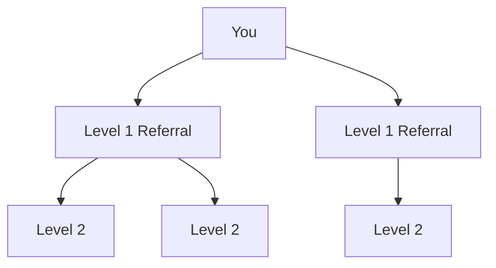

# Affiliate System

## Earn by Sharing BoosterFi

Our affiliate program rewards you for growing the BoosterFi community. Earn bonuses when your referrals deposit into the protocol.

---

## How It Works

### Step 1: Get Your Referral Link

1. Connect your wallet at [app.boosterfi.app](https://app.boosterfi.app)
2. Navigate to the "Referral" section
3. Copy your unique referral link
4. Share with friends and community

### Step 2: Earn Commissions

When someone uses your link and deposits:

- You earn a percentage of their deposit as bonus
- Commissions are paid instantly
- No limit on referrals

---

## Commission Structure

### Multi-Level Referral System

| Level | Description | Commission |
|-------|-------------|------------|
| **Level 1** | Direct referrals (people you invite) | Higher bonus |
| **Level 2** | Referrals of your referrals | Medium bonus |
| **Level 3+** | Extended network | Cascading bonus |

---

## Referral Benefits

### For You (Referrer)

| Benefit | Description |
|---------|-------------|
| :material-cash-fast: **Instant Bonuses** | Earn immediately when referrals deposit |
| :material-refresh: **Passive Income** | Build a network, earn continuously |
| :material-infinity: **No Cap** | Unlimited referral potential |
| :material-chart-line: **Track Progress** | Dashboard shows all referrals and earnings |

### For Your Referrals

| Benefit | Description |
|---------|-------------|
| :material-gift: **Welcome Bonus** | New users may receive deposit bonuses |
| :material-account-group: **Community** | Join a growing DeFi community |
| :material-school: **Education** | Learn about Flash Loan yields |

---

## Best Practices

### Sharing Tips

1. **Explain the Value** — Help people understand Flash Loan yields
2. **Be Transparent** — Share both benefits and risks
3. **Target DeFi Users** — Focus on crypto-savvy audiences
4. **Use Social Media** — Twitter, Telegram, Discord communities
5. **Create Content** — Tutorials, reviews, explainers

### Where to Share

| Platform | Strategy |
|----------|----------|
| **Twitter/X** | Share insights about Flash Loans and DeFi yields |
| **Telegram** | Join DeFi groups and share your experience |
| **Discord** | Engage in crypto communities |
| **YouTube** | Create tutorial videos |
| **Reddit** | Participate in r/defi and r/cryptocurrency |

---

## Tracking Your Referrals

### Dashboard Features

- Total referrals count
- Active vs. inactive referrals
- Total commissions earned
- Pending commissions
- Referral link performance

---

## Rules & Guidelines

!!! success "Do's"
    - :material-check: Share accurate information about the protocol
    - :material-check: Disclose that you earn commissions
    - :material-check: Help your referrals understand the platform
    - :material-check: Answer questions honestly

!!! danger "Don'ts"
    - :material-close: Make unrealistic promises about returns
    - :material-close: Spam or harass potential users
    - :material-close: Misrepresent the risks involved
    - :material-close: Use fake accounts or bots

---

## FAQ

??? question "When do I receive my commissions?"
    Commissions are credited instantly when your referral makes a deposit.

??? question "Is there a minimum withdrawal for commissions?"
    Check the app for current minimum withdrawal requirements.

??? question "Can I refer myself?"
    No, self-referrals are not allowed and may result in account restrictions.

??? question "Do referral bonuses expire?"
    Active referral links do not expire.

---

## Get Started

1. Visit [app.boosterfi.app](https://app.boosterfi.app)
2. Connect your wallet
3. Go to "Referral" section
4. Copy your unique link
5. Start sharing!

[Get Your Referral Link :material-arrow-right:](https://app.boosterfi.app){ .md-button .md-button--primary }

---

**Questions?** Contact us on [Telegram](https://t.me/boosterfi)
