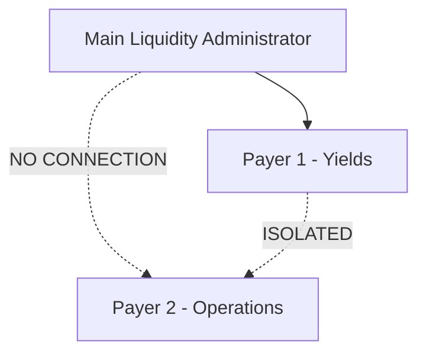

# Smart Contracts

## Protocol Architecture

BoosterFi operates three primary smart contracts on **Arbitrum One** (Ethereum Layer 2), all verified and immutable with permanently renounced admin keys.

---

## Core Contracts

### Main Liquidity Administrator

!!! info "Contract Address"
    `0x1D262425dc046b8bb26B4DB4f4Cd754804208049`

    [:material-open-in-new: View on Arbiscan](https://arbiscan.io/address/0x1D262425dc046b8bb26B4DB4f4Cd754804208049)

**Functions:**

- Manages USDC deposits from liquidity providers
- Tracks proportional ownership shares
- Deploys capital for Flash Loan availability
- Processes withdrawals after lock periods expire

---

### Payer 1 - Yield Distribution

!!! info "Contract Address"
    `0x0c1133d9bc4d4ad6c439888ab4b4cb26b997aed0`

    [:material-open-in-new: View on Arbiscan](https://arbiscan.io/address/0x0c1133d9bc4d4ad6c439888ab4b4cb26b997aed0)

**Functions:**

- Collects Flash Loan fees
- Calculates proportional yield distributions
- Enables LP claims at any time
- Operates autonomously with no admin functions

---

### Payer 2 - Operations

!!! info "Contract Address"
    `0x43DFb116A20dBb7085FBf8aB68E085b269158117`

    [:material-open-in-new: View on Arbiscan](https://arbiscan.io/address/0x43DFb116A20dBb7085FBf8aB68E085b269158117)

**Functions:**

- Manages protocol operations
- Processes Flash Loan executions
- Automatically transfers protocol fees to Payer 1
- Uses access control modules to restrict function calls

---

## Security Architecture

### Fund Segregation

Zero code paths exist between Payer 1 and Payer 2 contracts. This architectural decision ensures that operational vulnerabilities cannot compromise liquidity provider funds.

### Admin Key Renunciation

Both main and yield distribution contracts have executed **irreversible renunciations** through on-chain transactions, setting the owner address to `0x0000...0000`.

!!! success "What This Means"
    - :material-close: No one can pause operations
    - :material-close: No one can modify parameters
    - :material-close: No one can upgrade contract logic
    - :material-close: No one can withdraw user funds
    - :material-check: The protocol runs **autonomously**

---

## Key Functions

### For Liquidity Providers

| Function | Description |
|----------|-------------|
| `deposit()` | Deposit USDC into the protocol |
| `withdraw()` | Withdraw USDC after lock period |
| `claimYields()` | Claim accumulated earnings |
| `getProviderBalance()` | View your current balance |
| `getAccumulatedYields()` | View pending yields |

### For Protocol Operations

| Function | Description |
|----------|-------------|
| `distributeYields()` | Distribute fees to LPs |
| `executeFlashLoan()` | Execute a Flash Loan |
| `getPoolLiquidity()` | View total pool liquidity |

---

## External Integrations

| Contract | Address |
|----------|---------|
| **USDC Token** | `0xaf88d065e77c8cC2239327C5EDb3A432268e5831` |
| **WETH Token** | `0x82aF49447D8a07e3bd95BD0d56f35241523fBab1` |

---

## Verification

All contracts are:

- [x] Verified on [Arbiscan](https://arbiscan.io)
- [x] Open-source
- [x] Immutable (no upgrade capability)
- [x] Admin keys renounced

---

## How to Verify

1. Go to [Arbiscan](https://arbiscan.io)
2. Search for the contract address
3. Click on "Contract" tab
4. View "Read Contract" and "Write Contract" functions
5. Verify the code matches our documentation

!!! tip "Verify Admin Renunciation"
    Click "Read Contract" → Find `owner()` → Should return `0x0000000000000000000000000000000000000000`
