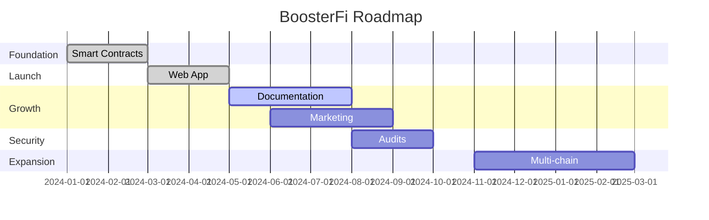

# Roadmap

## BoosterFi Development Phases

Our roadmap outlines the journey from initial development to becoming the leading Flash Loan liquidity protocol on Arbitrum and beyond.

---

## Phase 1: Foundation :material-check-circle:{ .success }

**Status: Completed**

### Deliverables

- [x] Smart contract development
- [x] Core protocol architecture
- [x] Security implementation
- [x] Internal testing
- [x] Contract deployment on Arbitrum

### Highlights

- 3 core smart contracts deployed
- Fund segregation architecture implemented
- Admin keys renounced for security

---

## Phase 2: Launch :material-check-circle:{ .success }

**Status: Completed**

### Deliverables

- [x] Web application development
- [x] User interface design
- [x] Wallet integration (MetaMask)
- [x] Deposit/withdrawal functionality
- [x] Yield claiming system
- [x] App launch at [app.boosterfi.app](https://app.boosterfi.app)

### Highlights

- Fully functional DeFi application
- Clean, intuitive user interface
- Real-time yield tracking

---

## Phase 3: Growth :material-progress-clock:{ .warning }

**Status: In Progress**

### Deliverables

- [x] Landing page development
- [ ] Documentation portal (docs.boosterfi.app)
- [ ] Multi-language support
- [ ] Community building
- [ ] Marketing campaigns
- [ ] Influencer partnerships

### Current Focus

- Expanding documentation
- Building community presence
- User acquisition strategies

---

## Phase 4: Security :material-clock-outline:

**Status: Upcoming**

### Deliverables

- [ ] Third-party security audits
- [ ] Bug bounty program
- [ ] Penetration testing
- [ ] Audit report publication
- [ ] Security certifications

### Goals

- Independent verification of smart contracts
- Public audit reports for transparency
- Continuous security monitoring

---

## Phase 5: Public Launch :material-clock-outline:

**Status: Future**

### Deliverables

- [ ] Official public launch
- [ ] PR and media coverage
- [ ] Exchange listings (if applicable)
- [ ] Partnership announcements
- [ ] Community events

### Goals

- Mass adoption push
- Institutional partnerships
- Major DeFi integrations

---

## Phase 6: Expansion :material-clock-outline:

**Status: Future**

### Deliverables

- [ ] Multi-chain deployment
- [ ] Additional L2 networks (Optimism, Base, zkSync)
- [ ] Cross-chain Flash Loans
- [ ] Advanced yield strategies
- [ ] Protocol governance (optional)

### Potential Networks

| Network | Status |
|---------|--------|
| **Arbitrum** | :material-check: Live |
| **Optimism** | :material-clock: Planned |
| **Base** | :material-clock: Planned |
| **zkSync** | :material-help: Under evaluation |
| **Polygon** | :material-help: Under evaluation |

---

## Long-Term Vision

### Year 1 Goals

- Establish BoosterFi as the go-to Flash Loan liquidity protocol
- Build a strong, engaged community
- Achieve significant TVL (Total Value Locked)
- Complete all security audits

### Year 2+ Goals

- Multi-chain presence
- Institutional partnerships
- Advanced DeFi integrations
- Protocol sustainability

---

## Timeline Overview

---

## How to Stay Updated

- :material-twitter: **Twitter:** Follow [@boosterfi](https://twitter.com/boosterfi) for announcements
- :material-telegram: **Telegram:** Join [t.me/boosterfi](https://t.me/boosterfi) for discussions
- :material-book: **Docs:** Check [docs.boosterfi.app](https://docs.boosterfi.app) for updates

---

## Community Input

We value community feedback! If you have suggestions for our roadmap:

1. Join our Telegram community
2. Share your ideas
3. Participate in discussions
4. Help shape the future of BoosterFi

[Join the Discussion :material-arrow-right:](https://t.me/boosterfi){ .md-button }

---

**Building the future of Flash Loan liquidity, together.**
